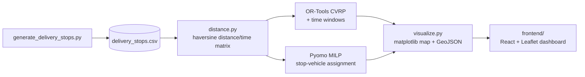
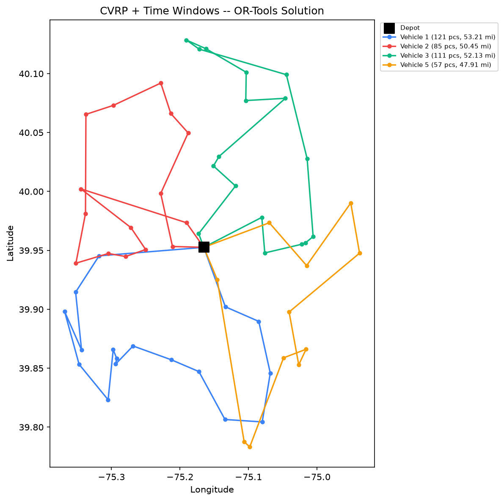
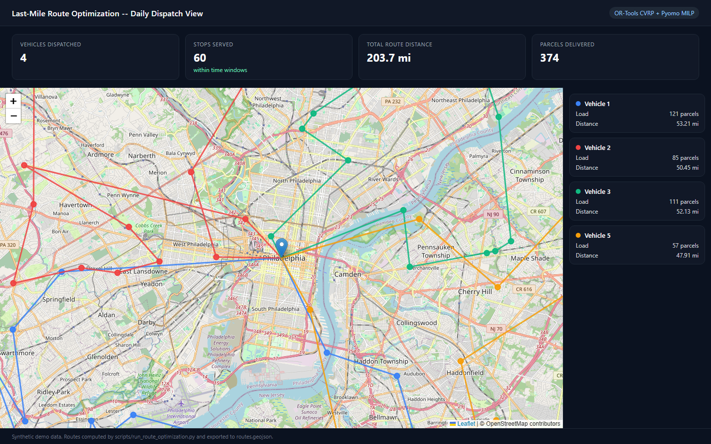

# Last-Mile Delivery Route Optimization (CVRP + MILP)

Two complementary ways to solve the same daily dispatch problem --
*"given today's delivery stops, parcel counts, delivery windows, and a
fleet of vehicles, how should stops be grouped into routes to minimize
total distance while respecting vehicle capacity and time windows?"*

1. **Google OR-Tools** -- a capacitated VRP with time windows, solved with
   constraint-programming local search. This is the solver you reach for
   once a problem is too large (hundreds of stops) for an exact solve to
   finish in a dispatch-relevant amount of time.
2. **Pyomo MILP** -- an exact Mixed-Integer Linear Program for the
   stop-to-vehicle assignment sub-problem, solved with the open-source
   HiGHS solver through Pyomo's `appsi_highs` interface. The same model
   code runs unmodified against **Gurobi** or **CPLEX** by changing a single
   `SolverFactory` string -- see [Solver backends](#solver-backends) below.

A small React + Leaflet dashboard (`frontend/`) renders the optimized
routes on a map so dispatchers can sanity-check the plan before it goes out.

> **Note on data:** stop locations, parcel counts, and time windows in
> `data/generate_delivery_stops.py` are synthetically generated around an
> arbitrary metro-area coordinate. No real address or customer data is used.

---

## Why two solvers for one problem

| | OR-Tools CVRP | Pyomo MILP |
|---|---|---|
| What it decides | Full route **sequence** per vehicle | Stop **assignment** to a vehicle (no ordering) |
| Solution quality | Very good, not certified optimal | **Certified optimal** (or a provable gap) |
| Scales to | Hundreds of stops, sub-10s | Tens to low-hundreds of binary variables before slowing down |
| Handles time windows | Yes (native dimension) | Not in this formulation (see "Extending" below) |
| Solver | Constraint-programming local search | Any Pyomo-supported LP/MILP backend |

In practice, a routing/scheduling team often uses both: an exact MILP for a
smaller, business-critical sub-problem where an optimality certificate
matters (e.g. "how do we split today's priority stops across our first
three trucks"), and a metaheuristic like OR-Tools for the full-scale
routing problem where "very good, fast" beats "provably optimal, slow."

---

## Architecture



---

## Repository layout

```
last-mile-route-optimization/
├── data/
│   ├── generate_delivery_stops.py   # synthetic 60-stop daily manifest
│   └── delivery_stops.csv           # generated on first run
├── src/routing/
│   ├── distance.py                  # haversine distance/time matrices
│   ├── or_tools_solver.py           # CVRP + time windows (OR-Tools)
│   ├── pyomo_milp_solver.py         # exact assignment MILP (Pyomo + HiGHS)
│   └── visualize.py                 # matplotlib map + GeoJSON export
├── scripts/
│   └── run_route_optimization.py    # end-to-end: solve both, plot, export
├── frontend/                        # React + Leaflet dispatch dashboard
│   ├── index.html
│   ├── Dockerfile
│   └── routes.geojson               # generated by the script above
├── tests/
└── .github/workflows/ci.yml
```

---

## Quickstart

```bash
python -m venv .venv && source .venv/bin/activate
pip install -r requirements.txt

python scripts/run_route_optimization.py
```

Example output:

```
Loaded 60 delivery stops, total demand = 374 parcels

[1/2] Solving full CVRP + time windows with OR-Tools (local search)...
  Solved in 10.09s using 4 vehicles, total distance = 203.69 miles
    Vehicle 1: 17 stops, 121 parcels, 53.21 mi
    Vehicle 2: 15 stops, 85 parcels, 50.45 mi
    ...

[2/2] Solving exact stop-to-vehicle assignment MILP with Pyomo + HiGHS...
  Status: optimal, solved in 0.045s
  Objective (total depot-to-stop distance): 501.98 miles
  Vehicles used: 6
```

(The MILP's objective is the sum of straight-line depot-to-stop distances
for the assignment it picked, not a routed total -- it is solving a
different, smaller sub-problem than the CVRP, per the comparison table
above, so the two "distance" numbers are not directly comparable.)

Run the tests: `pytest -v`

---

## Results



Each color is one vehicle's route, starting and ending at the depot
(black square). The solver balances load across vehicles (subject to the
140-parcel capacity) while keeping each route's total distance low and
respecting every stop's delivery window.

---

## Dispatch dashboard (React + Leaflet)

`scripts/run_route_optimization.py` exports the OR-Tools solution as
`frontend/routes.geojson`, which the dashboard renders on an interactive
map -- this is the piece a dispatcher would actually look at each morning.



Run it locally (see `frontend/README.md` for the Docker version):

```bash
cd frontend
python -m http.server 8080   # open http://localhost:8080
```

---

## Solver backends

The Pyomo model in `pyomo_milp_solver.py` is solver-agnostic by
construction -- the variables, objective, and constraints never reference
a specific solver. Switching backends is one line:

```python
# Open-source default used in this repo (no license required)
solver = pyo.SolverFactory("appsi_highs")

# Commercial solvers -- same model, same constraints, no other code changes
solver = pyo.SolverFactory("gurobi")
solver = pyo.SolverFactory("cplex")
```

This is the main practical argument for building optimization models in a
modeling layer like Pyomo (or `pulp`) rather than calling a solver's native
API directly: the model becomes portable across whatever solver is
licensed/available in a given environment (a real constraint when moving
from a laptop prototype to an enterprise deployment with an existing
Gurobi or CPLEX site license).

---

## Extending this model

- **Time windows in the MILP**: add a continuous arrival-time variable per
  stop and big-M constraints linking consecutive assigned stops -- this
  turns the assignment MILP into a small exact VRPTW, at the cost of much
  worse scaling (this is exactly why OR-Tools exists for the full-size
  problem).
- **Multi-day planning**: extend the objective to balance driver hours
  across a week, not just one day's routes.
- **Feed from the forecasting repo**: [`parcel-volume-forecasting`](../parcel-volume-forecasting)
  produces a demand forecast; a natural extension is to size `n_vehicles`
  and `vehicle_capacity` dynamically from tomorrow's forecast rather than
  hardcoding them.
- **Workforce tie-in**: [`workforce-capacity-optimization`](../workforce-capacity-optimization)
  solves the companion problem of how many drivers/shifts to staff based on
  forecasted volume -- route optimization then operates within that
  staffing plan.

---

## License

MIT -- see [LICENSE](LICENSE).
